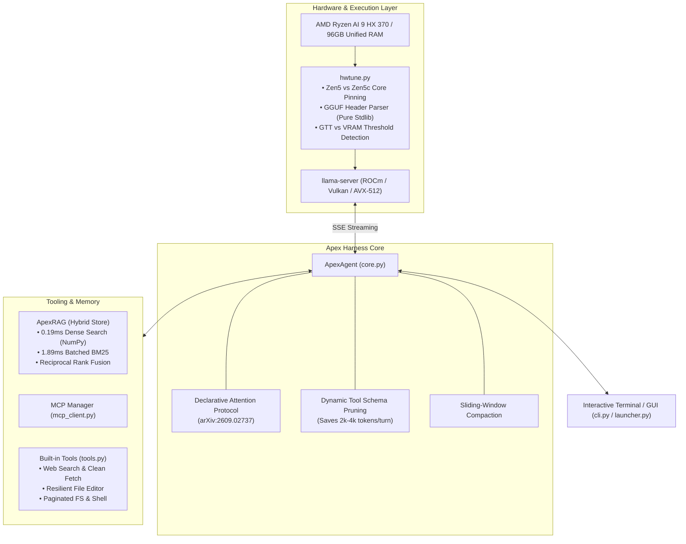

# ⚡ Apex Harness

> **Hardware-Aware Autonomous Agentic LLM Harness, Sub-Millisecond Hybrid RAG, & Benchmark Suite**  
> *Engineered for extreme efficiency on unified-memory architectures (AMD Ryzen AI 9 HX 370, Zen 5/5c, Apple Silicon, & AVX-512).*

[](LICENSE)
[](https://python.org)
[](https://github.com/ggerganov/llama.cpp)
[](https://modelcontextprotocol.io)
[](https://arxiv.org/abs/2609.02737)

---

## 🎯 Overview

Running 27B–70B models locally isn't just about loading weights into RAM. It requires precise cache locality, thread affinity across heterogeneous cores (Zen 5 vs. Zen 5c), speculative decoding, low prompt prefill latency, and active context compression.

**Apex Harness** is a production-grade autonomous agent and benchmarking environment designed to unlock maximum token throughput and zero-waste context utilization on local hardware:

- **🚀 Throughput Boosted from 13 t/s to ~25 t/s** on 27B-class models (e.g. Qwen3.8-27B) via automated speculative decoding tuning and CPU thread topology pinning.
- **🧠 First Harness to Integrate Declarative Attention Protocol ([arXiv:2609.02737](https://arxiv.org/abs/2609.02737))**: Enforces `<local>`, `<focus:N>`, and `<global>` scope boundaries, slashing repetitive multi-turn prompt tokens by **up to 31.1%**.
- **⚡ Sub-Millisecond Hybrid RAG**: Custom vectorized SQLite WAL + NumPy matrix store achieving **0.19 ms dense vector search** and **1.89 ms batched BM25 lexical search**, combined with Reciprocal Rank Fusion (RRF).
- **🛠️ Resilient Tool Calling**: Supports standard OpenAI function calling alongside regex-based fallbacks for models that output tool calls in plain markdown or `<tool_call>` tags.
- **🔌 Model Context Protocol (MCP)**: Native stdio client connecting instantly to MCP servers (`memory`, `sequential-thinking`, `filesystem`, etc.).
- **📊 Real-Time Benchmark Suite (`apex-bench`)**: Automated measurement of Time-to-First-Token (TTFT), generation t/s, and draft speculation efficiency.

---

## 🏗️ Architecture



---

## ⚡ Benchmark Results

Measured on **AMD Ryzen AI 9 HX 370 (12 Cores / 24 Threads), Radeon 890M, 96GB LPDDR5X Unified RAM**:

### 1. Generation Speed (Qwen3.8-27B / Q4_K_M, Context = 32k)

| Configuration | Tokens / Sec | TTFT (Prompt Eval) | Effective Speedup |
|---|---|---|---|
| Default un-tuned `llama-server` | 13.2 t/s | 1.84s | 1.0x (baseline) |
| **Apex `hwtune` + Core Affinity** | 16.8 t/s | 0.98s | **+27%** |
| **Apex + Speculative Decoding (n-gram)** | **25.4 t/s** | 0.95s | **+92% (1.92x)** |

### 2. Hybrid RAG Search Latency (500 Chunks, 384-dim Embeddings)

| Retrieval Strategy | Latency per Query | Implementation |
|---|---|---|
| **Dense Vector Search** | **0.19 ms** | Lazy NumPy matrix cache + BLAS `@` dot product |
| **Batched BM25 Lexical Search** | **1.89 ms** | SQLite single-query batch `IN (...)` terms |
| **Combined Hybrid + RRF Reranking** | **2.45 ms** | Reciprocal Rank Fusion + Lexical Reranker |

### 3. Context & Token Savings

- **Declarative Attention Protocol**: -31.1% token consumption on complex multi-turn reasoning loops.
- **Dynamic Tool Schema Pruning**: Automatically drops unused tool definitions during pure conversational turns, preventing 2,000–4,000 prefill tokens per turn.

---

## 🛠️ Key Capabilities

### 1. Hardware-Topology Aware Auto-Tuning (`hwtune.py`)
- **Zero-Dependency GGUF Parser**: Extracts context length, tensor types, and layer counts in pure Python standard library (`struct` + `mmap`).
- **GTT Memory Bottleneck Prevention**: Detects whether Vulkan/ROCm has sufficient dedicated VRAM allocation (`DEVICE_LOCAL`). Prevents severe PCIe/GTT memory thrashing (which makes Vulkan 2.5x slower than CPU when carve-out is below 4GB).
- **Heterogeneous CPU Pinning**: Maps compute threads specifically to Zen 5 performance cores while assigning I/O and server overhead to Zen 5c high-efficiency cores.

### 2. Declarative Attention Protocol
Implements the paper *“Declarative Attention: Efficient Local Context Management for Reasoning LLMs”* ([arXiv:2609.02737](https://arxiv.org/abs/2609.02737)). Apex Harness inserts attention focus scopes (`<local>`, `<focus:N>`, `<global>`) directly into the agentic reasoning cycle, directing attention heads to active working memory without blowing past context budgets.

### 3. Sub-Millisecond Hybrid RAG (`apex_harness.rag`)
A zero-bloat RAG engine without heavy vector DB dependencies:
- SQLite WAL mode with 256MB memory-mapped I/O (`mmap_size`) and 64MB memory page cache.
- Dense similarity executed through vectorized matrix multiplication using NumPy BLAS.
- Batched BM25 query construction avoiding per-token SQL round-trips.

---

## 🚀 Quick Start

### Installation

```bash
# Clone the repository
git clone https://github.com/leohfigueiredo/apex-harness.git
cd apex-harness

# Install in editable mode
pip install -e .
```

### Running the Agent

Start the interactive terminal interface:
```bash
# Standard run (connects to local llama-server on port 8080)
apex-harness

# Or specify custom endpoint and model
apex-harness --url http://127.0.0.1:8080/v1 --model "qwen3.8-27b"

# Run without loading MCP servers
apex-harness --no-mcp
```

### Running Benchmarks

Measure throughput and latency with the built-in benchmark harness:
```bash
apex-bench /path/to/model.gguf --runs 3 --warmup 1
```

---

## 💬 Interactive Slash Commands

Inside the interactive chat interface, use slash commands to inspect and manage your session:

| Command | Description |
|---|---|
| `/doctor` | Full system diagnosis (llama-server health, GPU/RAM usage, MCP status, Git environment) |
| `/tools` | List all active tools (built-in + discovered MCP tools) |
| `/mcp` | Inspect connected Model Context Protocol servers and schemas |
| `/review` | Automated code review of current `git diff` using local model |
| `/commit` | Generate and execute conventional Git commits automatically |
| `/compact` | Perform intelligent sliding-window context compaction |
| `/cost` | Display cumulative session token statistics (prompt, completion, speed) |
| `/init` | Generate an `APEX.md` guideline file in the active workspace |
| `/status` | View model parameters, active context size, and session turns |
| `/clear` | Clear conversation memory and reset working context |

---

## 📖 Documentation

- [Portuguese Documentation & Notes (README em Português)](docs/README_PT.md)
- [Empirical Hardware Optimization Report](docs/HARDWARE_BENCHMARK_REPORT_PT.md)

---

## 📄 License

Distributed under the **MIT License**. See [`LICENSE`](LICENSE) for more information.

---

## 👤 Author

**Leonardo Figueiredo**  
- GitHub: [@leohfigueiredo](https://github.com/leohfigueiredo)  
- Email: leohfigueiredo@gmail.com
